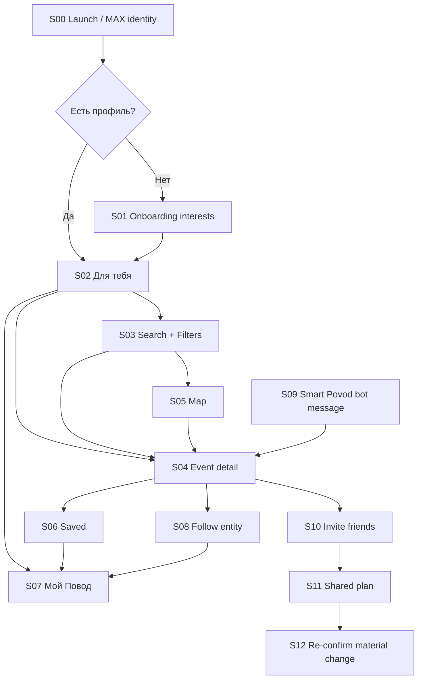

# ПОВОД — PRODUCT SPEC v1
**Команда:** The Boys  
**Дата:** 17.09.2026  
**Статус:** scope/design contract frozen for implementation handoff  
**Основа:** исходный пакет The Boys + принятые в рабочем чате решения.

---

# 1. Product definition

## 1.1. Коротко
**Повод** — персональная афиша и навигатор событий внутри MAX.

Продукт помогает человеку:
1. быстро задать свои условия;
2. найти конкретное событие / конкретный сеанс;
3. понять дату, время, цену или её неизвестность, место и источник;
4. сохранить событие или подписаться на интересующую сущность;
5. вернуться к подходящим событиям позже через персонализацию и «умные поводы»;
6. при желании позвать друзей и продолжить уже выбранный вариант совместно.

## 1.2. Главный продуктовый принцип
**Solo-first.**

Личный путь считается полноценным без:
- создания группы;
- приглашения друзей;
- общего плана;
- регистрации через email/телефон;
- покупки билета внутри «Повода».

Совместный сценарий — optional continuation.

## 1.3. Product promise
> **События по твоим условиям. Выбери для себя. Потом, если захочешь, зови друзей.**

---

# 2. User problem / JTBD

## Основной JTBD
> Когда у меня есть свободный вечер или выходной и ограничения по времени, бюджету, месту или интересам, помоги быстро найти конкретное подходящее событие и понять, что ещё нужно проверить.

## Retention JTBD
> Когда появляются события моих любимых артистов, команд, тем или площадок, сообщи мне только о том, что действительно может мне подойти.

## Social JTBD
> Когда я уже нашёл хороший вариант, помоги быстро позвать друзей, не заставляя снова пересобирать всю информацию в чате.

---

# 3. Product principles

1. **Личная ценность раньше социальной.**
2. **Конкретный occurrence важнее абстрактного event.**
3. **UNKNOWN лучше выдуманного факта.**
4. **Источник и происхождение данных видимы.**
5. **Не обещаем покупку, наличие билетов или посещение без доказательств.**
6. **MAX identity ≠ участие в плане.**
7. **Preference ≠ explicit commitment.**
8. **Новый город включается только после data gate.**
9. **Фильтры работают без обязательного AI/LLM.**
10. **Бренд яркий, рабочий UI спокойный.**

---

# 4. Scope freeze

## 4.1. P0 — хакатонная версия

### Identity / account
- бесшовный вход через MAX identity;
- собственный `PovodUser` на backend;
- домашний город;
- базовый профиль предпочтений.

### Multi-city
- архитектура поддерживает произвольное число городов;
- пользовательский интерфейс показывает только города со статусом `beta` или `active`;
- целевой P0: **2–3 фактически допущенных города**, если data gate пройден;
- отсутствие достаточного покрытия города не маскируется ручными карточками.

### Discovery
- «Для тебя»;
- категории / интересы;
- структурные фильтры:
  - дата / период;
  - категория;
  - бюджет;
  - город / район;
  - при доступности — расстояние / радиус;
- natural-language intent только как дополнительный слой, если провайдер действительно подтверждён;
- карточки событий;
- detail конкретного сеанса;
- карта;
- переход к первоисточнику.

### Personalization
- onboarding интересов;
- сохранённые события;
- базовые подписки:
  - артист;
  - тема / категория;
- профиль «Мой Повод»;
- простое explainable ranking;
- один полноценный демонстрационный сценарий **«Умного повода»**.

### Social
- «Позвать друзей» с event/occurrence context;
- один shared plan;
- различение `preference` и `commitment`;
- re-confirmation при material change.

### Quality / honesty
- loading;
- empty;
- source unavailable;
- UNKNOWN;
- error;
- event ended / stale occurrence;
- no false PASS.

---

## 4.2. P1 — Product v1 после хакатона
- больше активных городов;
- подписки на:
  - команды;
  - виды спорта;
  - площадки;
  - серии / фестивали;
- несколько режимов уведомлений;
- более развитая персонализация;
- поведенческие сигналы;
- полноценное управление подписками;
- история / upcoming saved;
- расширенный shared plan;
- более глубокая аналитика рекомендаций;
- улучшенные web layouts.

## 4.3. P2 / Scale
- Россия по фактическому coverage;
- партнёрские источники;
- билетные интеграции — только после отдельного юридического и технического решения;
- кабинет организатора — только если подтверждена продуктовая необходимость;
- ML/AI-рекомендации после накопления качественных сигналов;
- B2B / клубные контексты отдельно от личного профиля.

---

# 5. Information architecture

## Bottom navigation P0

### 1. Для тебя
Персональная афиша / recommended feed.

### 2. Поиск
Каталог, фильтры, переключение список ↔ карта.

### 3. Сохранённые
События, которые пользователь явно сохранил.

## Top-level avatar
Открывает **Мой Повод**:
- профиль;
- домашний город;
- интересы;
- подписки;
- базовые предпочтения;
- уведомления;
- настройки.

## Contextual
**План** не является постоянным tab. Появляется только после явного социального действия.

---

# 6. Screen map



---

# 7. Screen contracts

# S00 — Launch / MAX identity

## Purpose
Открыть приложение без отдельной регистрации.

## Required
- получение platform identity;
- server-side validation по текущему безопасному контракту MAX;
- создание/загрузка `PovodUser`;
- loading state;
- понятная ошибка identity/bootstrap;
- отсутствие обязательного телефона/email.

## Acceptance
- повторный вход возвращает тот же профиль;
- новый пользователь не создаёт дубликат при обычном повторном запуске;
- identity клиента не принимается на веру без server validation;
- отсутствие social plan не блокирует вход.

---

# S01 — Onboarding interests

## Purpose
Получить минимальный явный сигнал для первой персонализации.

## UI
- «Что тебе интересно?»
- selectable topic cards/chips;
- минимум:
  - концерты;
  - выставки;
  - театр;
  - спорт;
  - стендап;
  - лекции;
  - кино / фестивали;
  - городские активности;
  - еда / гастрономия — только если реально есть покрытие;
- домашний город;
- optional:
  - бюджет;
  - обычное время;
  - радиус.

## Rules
- onboarding можно пропустить;
- не требовать выбрать N интересов ради прохода;
- выбор интереса сохраняется как explicit preference;
- не превращать onboarding в 8 экранов.

## Acceptance
- пользователь может получить feed даже без интересов;
- изменения позже доступны в «Мой Повод».

---

# S02 — «Для тебя»

## Purpose
Главный retention/discovery screen.

## Header
- compact «Повод»;
- текущий город;
- avatar;
- contextual date/time shortcut.

## Sections
1. `Подходит тебе`
2. optional `Сегодня`
3. optional `Из подписок`
4. optional `Рядом`

Не показывать секцию, если для неё нет данных.

## Event card minimum
- image;
- category;
- title;
- occurrence date/time;
- venue / locality;
- price display:
  - exact / from / free / UNKNOWN;
- source;
- 1–3 recommendation reasons;
- save control.

## Explainability examples
- `Любимый артист`
- `После 19:00`
- `До 2500 ₽`
- `В твоём районе`

Причина должна быть вычислена из данных/preferences.

## Acceptance
- card всегда ведёт к конкретному occurrence context;
- завершившийся occurrence не показывается как будущий;
- unknown price не преобразуется в 0 ₽;
- отсутствие координат не делает event неподходящим автоматически;
- social flow не появляется как prerequisite.

---

# S03 — Search + Filters

## Purpose
Дать контролируемый поиск, независимо от personalization.

## Search
- текстовый поиск;
- structured filters.

## P0 filters
- дата / период;
- категории;
- бюджет;
- город;
- район / место при наличии;
- бесплатно;
- время начала.

## Optional
- natural-language input, если provider approved.

## Rules
- filter state видим;
- пользователь понимает, что применено;
- no-results не ослабляет условия автоматически;
- reset явный.

## Acceptance
- фильтры восстанавливаются в рамках текущего session contract;
- `Нет подходящих` ≠ `Ошибка источника`;
- пользователь может снять конкретный фильтр из empty-state.

---

# S04 — Event detail

## Purpose
Дать всё необходимое для личного решения.

## Required blocks
### Hero
- image;
- title;
- category.

### Occurrence
- date;
- start time;
- end time if known;
- status.

### Place
- venue;
- address;
- locality;
- coordinates if known.

### Price
- normalized display;
- source/basis;
- UNKNOWN warnings.

### Why this
- factual match reasons.

### Provenance
- source name;
- external URL;
- fetched/checked time when contract supports it.

### Actions
1. **Primary:** `Открыть источник`
2. `На карте`
3. `Сохранить`
4. `Подписаться` when entity exists
5. **Secondary/social:** `Позвать друзей`

## Never claim
- «Купить билет», если покупки внутри продукта нет;
- «места есть» без live availability;
- «точно подходит» при UNKNOWN hard constraint.

## Acceptance
- source action opens correct source;
- UNKNOWN visibly separate from error;
- save persists;
- invite does not expose raw personal query.

---

# S05 — Map

## Purpose
Понять расположение событий из текущего result-set.

## Required
- selected marker;
- relevant nearby markers;
- list/map toggle;
- bottom sheet for selected occurrence;
- fallback if selected event has no coordinates.

## Branding
- red = selected event;
- map remains visually functional;
- no poster collage over map.

## Acceptance
- marker maps to same occurrence as card/detail;
- changing selection updates bottom sheet;
- missing coordinates produce honest fallback, not fake point.

---

# S06 — Saved

## Purpose
Личный список событий для возврата.

## States
- upcoming;
- changed;
- ended;
- unavailable.

## Rules
Favorite links to a stable internal event/occurrence reference, not only external URL.

## Material changes
If saved occurrence changes materially, show badge:
- `Время изменилось`
- `Цена изменилась`
- `Сеанс завершён`

## Acceptance
- save/remove works across supported clients after server sync;
- ended events remain distinguishable or move to history policy;
- missing source does not silently delete user intent.

---

# S07 — «Мой Повод»

## Purpose
Единый центр персонализации.

## Blocks
### Identity
- MAX avatar/name where allowed;
- current/home city.

### Interests
- explicit topics.

### Subscriptions
- followed artists/topics;
- count;
- manage.

### Preferences
P0:
- default budget;
- usual time window;
- optional radius;
- home city.

### Notifications
- smart prompts on/off;
- basic permission/consent state.

### Privacy / settings
- clear session/account settings;
- later: retention/delete controls according to accepted policy.

## Acceptance
- changes immediately influence subsequent recommendation calculations;
- account settings are not mixed with shared-plan membership.

---

# S08 — Follow entity

## Purpose
Подписаться на устойчивый объект, а не на случайную карточку.

## P0 supported entity types
- `artist`
- `topic`

## Later
- `team`
- `sport`
- `venue`
- `series`

## UI
`Подписаться на Сироткина`
`Подписаться на стендап`

## Acceptance
- duplicate follow impossible;
- unfollow works;
- follow itself does not imply notification consent if those are separated by policy.

---

# S09 — «Умный повод»

## Purpose
Вернуть пользователя в продукт по релевантному событию.

## P0 scenario
User:
- follows artist/topic;
- has explicit city/time/budget preferences.

System finds a new occurrence satisfying configured rule.

Bot message example:
> **Есть Повод**  
> Сироткин — в пятницу в 20:00  
> 1900 ₽ · Москва  
> Подходит под твои условия.

CTA:
`Посмотреть`

## Rules
- deep-link/open to exact detail;
- no notification if event ended;
- no false price;
- recommendation reasons based on stored explicit facts;
- notification frequency not spammy.

## Acceptance
- opening a notification resolves to current occurrence;
- if conditions changed since notification, detail shows current state and warning.

---

# S10 — Invite friends

## Purpose
Перевести уже выбранный event into social context.

## Shared payload
- event_id;
- occurrence_id;
- occurrence date/time;
- venue;
- price snapshot + basis;
- source;
- warnings.

## Never auto-share
- raw personal query;
- search history;
- rejected cards;
- all private preferences.

## Acceptance
- invite begins only after explicit action;
- personal result remains valid without invite.

---

# S11 — Shared plan

## Purpose
Собрать ответы друзей вокруг уже выбранного варианта.

## Statuses
- invited;
- viewed;
- preference_yes / maybe / no;
- committed_current_terms.

## Key distinction
`Мне подходит` != `Подтверждаю текущие условия`.

## Acceptance
- organizer cannot silently confirm for another user;
- count of interested people != ticket availability;
- group membership does not reveal private profile.

---

# S12 — Material change / re-confirm

## Trigger examples
- occurrence changed;
- start time changed materially;
- venue changed;
- relevant price changed;
- important restriction/warning changed.

## Behavior
Old explicit commitment becomes stale.

UI:
> **Условия изменились**  
> Проверьте обновление и подтвердите ещё раз.

## Acceptance
- old response remains in history/audit if contract requires;
- current plan does not present old commitment as new consent.

---

# 8. Multi-city contract

## City statuses
```text
draft
→ data_check
→ beta
→ active
→ paused
```

## UI visibility
- `draft`, `data_check` — hidden from normal selector;
- `beta` — visible with beta marker;
- `active` — visible normally;
- `paused` — unavailable with explanation.

## Proposed data gate inherited from prior project materials
Before activating a city, run the pre-defined 12-task matrix.

**Proposed threshold:** at least 8/12 tasks have at least one independently verified suitable occurrence and zero false PASS for critical constraints.

This threshold is a project proposal, not measured coverage of a city.

## Multi-city principle
Architecture supports many cities; product availability follows real data quality.

## Unsupported city
Optional capture:
`Повод пока собирается в вашем городе`  
`Сообщить, когда появимся`

No promise of launch date.

---

# 9. Personalization v1

## 9.1. Explicit signals P0
- home city;
- active city;
- selected interests;
- follows;
- budget;
- time preference;
- radius if available;
- explicit search filters.

## 9.2. Behavioral signals
### P0
Use conservatively:
- favorite;
- source opened;
- follow.

### P1
- hide/not interested;
- repeated category consumption;
- repeated venue/artist interactions;
- temporal patterns.

## 9.3. Ranking P0
No opaque «AI recommendation» claim.

Proposed explainable score:
```text
score =
  category_match
+ followed_entity_match
+ time_fit
+ budget_fit
+ distance_fit
+ freshness
```

Hard constraints cannot be compensated by soft score.

If required hard field is UNKNOWN:
- result may remain candidate;
- do not label confirmed fit for that condition.

## 9.4. Explanation object
Each recommended occurrence may include:
```json
[
  {"code":"FOLLOW_MATCH","label":"Любимый артист"},
  {"code":"TIME_FIT","label":"После 19:00"},
  {"code":"BUDGET_FIT","label":"До 2500 ₽"}
]
```

---

# 10. Core domain model

## 10.1. User
`User`
- id
- max_user_id
- display_name
- avatar_url
- locale
- created_at
- updated_at

## 10.2. UserPreferenceProfile
- user_id
- home_city_id
- default_budget_max
- preferred_start_time_from
- preferred_start_time_to
- preferred_radius_minutes/null
- smart_notifications_enabled
- updated_at

## 10.3. City
- id
- slug
- name
- timezone
- status
- beta_label
- coverage_checked_at
- activated_at/null

## 10.4. Category
- id
- slug
- name
- parent_id/null
- active

## 10.5. UserInterest
- user_id
- category_id
- weight/default=1
- source=`explicit`
- created_at

## 10.6. FollowableEntity
- id
- type: `artist|topic|team|sport|venue|series`
- name
- canonical_key
- metadata
- active

## 10.7. UserFollow
- user_id
- entity_id
- created_at
- notifications_enabled

## 10.8. Event
Long-lived conceptual event.
- id
- title
- description
- category_id
- primary_entity_ids[]
- image_url/null
- canonical_key/null
- status

## 10.9. Occurrence
Concrete session/instance.
- id
- event_id
- city_id
- venue_id/null
- starts_at
- ends_at/null
- timezone
- status: `scheduled|cancelled|ended|unknown`
- source_id
- external_url
- fetched_at
- source_updated_at/null

## 10.10. Venue
- id
- name
- city_id
- address/null
- lat/null
- lon/null
- source_id

## 10.11. PriceSnapshot
- id
- occurrence_id
- amount_min/null
- amount_max/null
- currency
- price_kind: `exact|from|range|free|unknown`
- fee_known: bool/null
- source_id
- observed_at

`unknown` is not zero.

## 10.12. Source
- id
- name
- provider_type
- base_url/null
- attribution
- data_mode
- active

## 10.13. Favorite
- user_id
- event_id
- preferred_occurrence_id/null
- created_at

## 10.14. RecommendationReason
- user_id
- occurrence_id
- code
- label
- strength
- generated_at

## 10.15. SmartNotification
- id
- user_id
- occurrence_id
- trigger_code
- sent_at/null
- opened_at/null
- state

## 10.16. SharedPlan
- id
- created_by_user_id
- event_id
- occurrence_id
- price_snapshot_id/null
- revision
- status
- created_at
- updated_at

## 10.17. SharedPlanMember
- plan_id
- user_id / invitee_ref
- membership_status
- preference_status
- commitment_revision/null
- updated_at

## 10.18. PlanMaterialRevision
- plan_id
- revision
- occurrence_snapshot
- venue_snapshot
- price_snapshot
- warnings_snapshot
- changed_fields[]
- created_at

---

# 11. State semantics

## Event vs occurrence
**Event:** «Сироткин — тур / концерт»  
**Occurrence:** «24 мая 2026, 20:00, VK Stadium»

Все hard-fit проверки идут по occurrence.

## Price
Must preserve:
- exact;
- from;
- range;
- free;
- unknown.

## Provenance
Every fact that matters for decision should be traceable to source or explicitly derived.

## UNKNOWN
UNKNOWN is a first-class state:
- price unknown;
- fee unknown;
- end time unknown;
- coordinates unknown.

It must never silently become:
- 0;
- false;
- empty success.

---

# 12. API interface draft
This is a **product contract**, not a mandate to replace existing backend architecture.

## Identity
`POST /session/max`
- validated platform payload
- returns current user/bootstrap

## Me
`GET /me`
`PATCH /me/preferences`

## Cities
`GET /cities`

## Discovery
`GET /occurrences`
Query:
- city
- date_from/date_to
- categories[]
- price_max
- free
- start_time_from
- q
- cursor

## Detail
`GET /occurrences/{id}`

## Favorites
`GET /me/favorites`
`PUT /me/favorites/{event_id}`
`DELETE /me/favorites/{event_id}`

## Interests
`GET /me/interests`
`PUT /me/interests`

## Follows
`GET /me/follows`
`PUT /me/follows/{entity_id}`
`DELETE /me/follows/{entity_id}`

## Plans
`POST /plans`
`GET /plans/{id}`
`POST /plans/{id}/responses`
`POST /plans/{id}/commit`
`POST /plans/{id}/revisions/{revision}/confirm`

## Notification open
`POST /notifications/{id}/open`

---

# 13. Error and status model

Suggested API error families:
- `IDENTITY_INVALID`
- `CITY_NOT_ACTIVE`
- `SOURCE_UNAVAILABLE`
- `OCCURRENCE_NOT_FOUND`
- `OCCURRENCE_ENDED`
- `VALIDATION_ERROR`
- `RATE_LIMITED`
- `DEPENDENCY_ERROR`
- `UNKNOWN_ERROR`

UI must distinguish:
- no match;
- no data;
- source error;
- validation error.

---

# 14. Analytics contract

No raw MAX messages or unnecessary PII in product analytics.

## Core events
- `app_opened`
- `onboarding_started`
- `onboarding_completed`
- `city_selected`
- `interest_added`
- `feed_viewed`
- `filter_applied`
- `search_submitted`
- `occurrence_opened`
- `source_opened`
- `map_opened`
- `favorite_added`
- `favorite_removed`
- `follow_added`
- `follow_removed`
- `smart_notification_sent`
- `smart_notification_opened`
- `invite_started`
- `plan_created`
- `plan_preference_submitted`
- `plan_committed`
- `plan_reconfirmation_required`
- `plan_reconfirmed`

## Product metrics
P0:
- successful solo path rate;
- median time to suitable occurrence;
- source-open rate after detail;
- save rate;
- follow rate;
- smart-notification open rate;
- optional social continuation rate;
- no-results rate;
- UNKNOWN rate by critical field;
- source error rate.

Do not convert these into claims until actually measured.

---

# 15. Privacy / security principles

1. Validate platform identity server-side.
2. Store only data required for product behavior.
3. Do not request phone number by default.
4. Do not share personal query/history into group flow.
5. Explicit notification preference.
6. Access to shared plan based on accepted plan permissions.
7. No secret/API keys in client bundle.
8. No private provider credentials in chat/presentation.
9. Retention/deletion policy must be accepted before production pilot.
10. MAX account identity does not equal consent to data sharing with other users.

---

# 16. Design implementation contract

## Brand
- light baseline;
- `#FFFDF8`
- `#0E0E0E`
- `#C63B2B`
- `#6C54FF`
- Onest
- IBM Plex Mono

## Semantic accent
- red = primary action / current selection;
- violet = social / people / shared context.

## Poster Pop intensity
- 80–100%: presentation / onboarding / promo;
- 20–35%: product UI.

## Required responsive checks
- 360 px
- 390 px
- 430 px
- MAX web centered content.

## Accessibility
Brand treatment cannot reduce:
- readable contrast;
- tap target clarity;
- source/UNKNOWN visibility;
- error comprehension.

---

# 17. Donor boundary

A donor may provide:
- navigation shell;
- event card base;
- filters;
- list/map layout;
- responsive patterns.

A donor must NOT redefine:
- solo-first;
- data semantics;
- Event vs Occurrence;
- UNKNOWN;
- provenance;
- social privacy;
- current backend architecture by default.

No donor is accepted until:
- exact commit;
- licence;
- install;
- build;
- runtime;
- 360/390/430 screenshots;
- blockers;
- extraction cost.

---

# 18. Pilot alignment

Existing project pilot logic remains the baseline.

Before external user pilot:
1. data gate;
2. application gate;
3. legal/terms gate;
4. participant-access gate.

Existing proposed test:
- 12 task matrix per city;
- no false critical PASS;
- 12 adult volunteers;
- paired comparison;
- no ticket purchase needed.

The addition of accounts/favorites/follows does **not** change the primary pilot outcome:
**can the user successfully complete the solo event-choice path?**

Retention functions are secondary measurements.

---

# 19. Definition of Done — Product Spec handoff

Ready for implementation when engineering receives:

- [x] product name / frame;
- [x] P0/P1/P2 scope;
- [x] IA;
- [x] screen map;
- [x] screen behavior;
- [x] multi-city state model;
- [x] account model;
- [x] favorites/follows contract;
- [x] smart notification scenario;
- [x] shared-plan semantics;
- [x] core domain entities;
- [x] API interface draft;
- [x] analytics names;
- [x] privacy principles;
- [x] design tokens / visual direction;
- [ ] final product wordmark SVG;
- [ ] final app icon;
- [ ] high-fidelity screens;
- [ ] runtime-approved donor OR direct-build decision;
- [ ] final implementation API mapped onto existing repository;
- [ ] real runtime screenshots/evidence.

---

# 20. Immediate next work

## Next no-code deliverable
**High-fidelity screen specification / UI Translation v2**

Priority screens:
1. S00 MAX launch;
2. S01 interests;
3. S02 Для тебя;
4. S03 filters;
5. S04 event detail;
6. S05 map;
7. S06 saved;
8. S07 Мой Повод;
9. S09 Smart Povod;
10. S11 shared plan.

## After that
1. runtime donor audit;
2. screen-to-component mapping;
3. implementation;
4. evidence;
5. final presentation / demo.

